# Manual

This section provides an overview of the features available in the interface.

Constants like server's host, server's port,... are not configurable within the interface. To change these constants, refer to config.json.

## Login Scene

Upon launch, users should see this login scene:

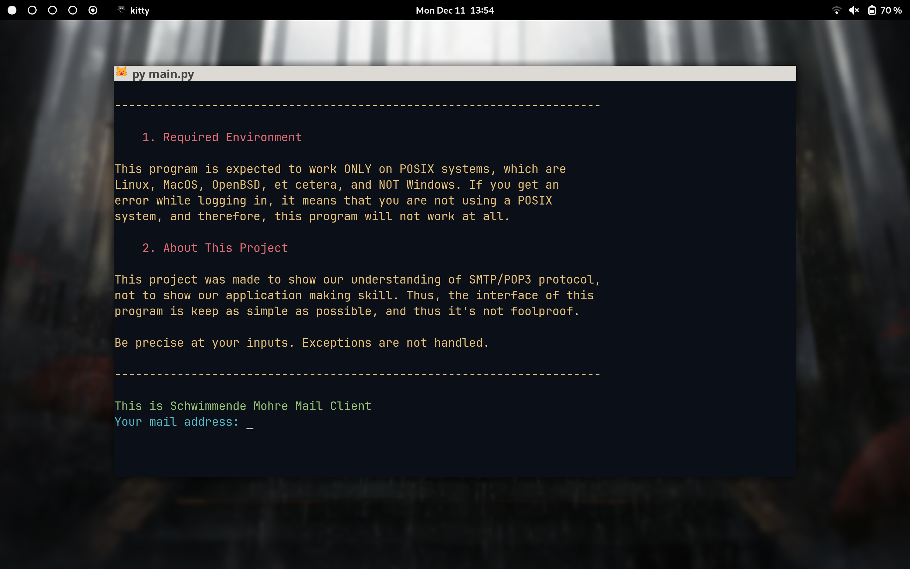

Since the test mail server doesn't require passwords, users only need to input their username.

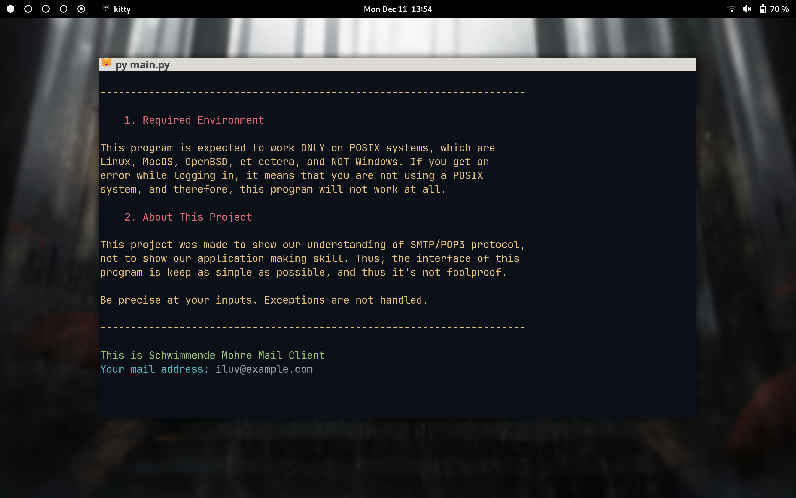

Upon successful login, users are directed to the menu scene.

## Menu Scene

Upon logging in, users are greeted with the menu scene:

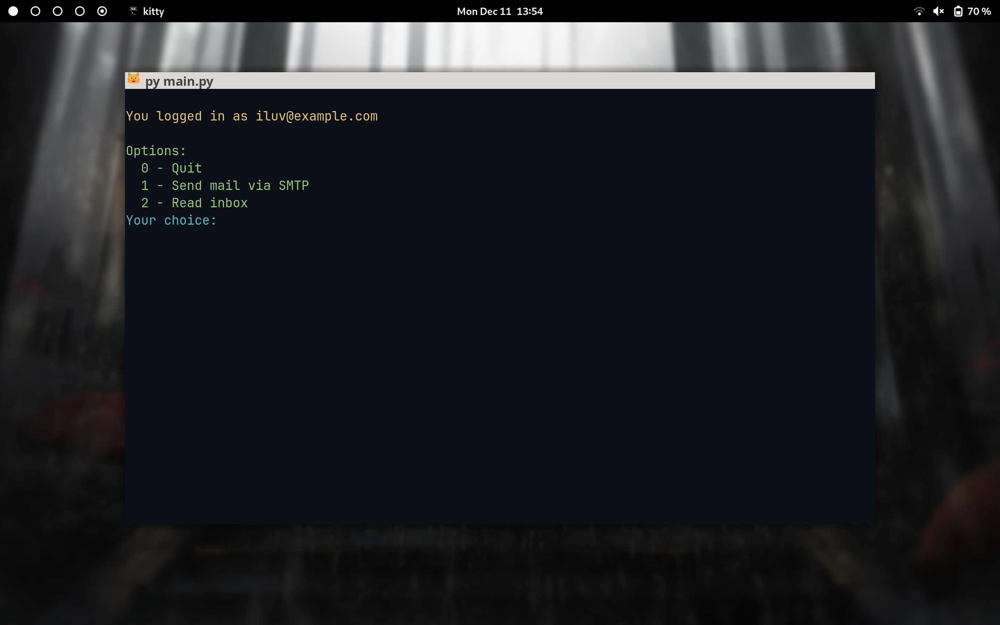

## Mail Composing Scene

Let's move to the mail composing scene. This interface allows users to interactively compose and send emails. Users can specify recipients in the TO, CC, and BCC fields; They can also send attachments within this scene:

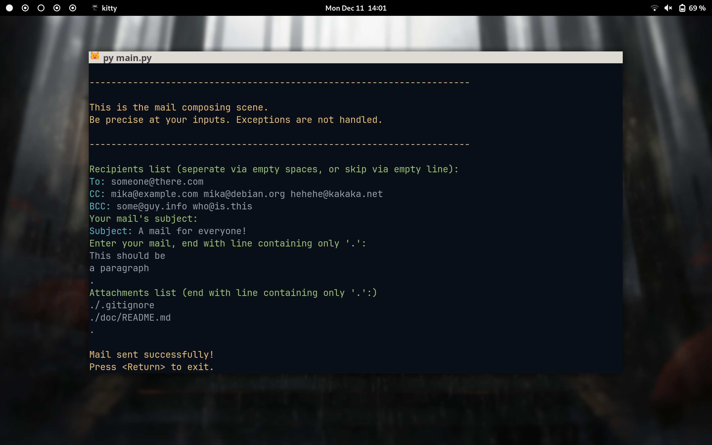

As we are required, we restrict users from sending attachments that exceeds a predertermined limit:

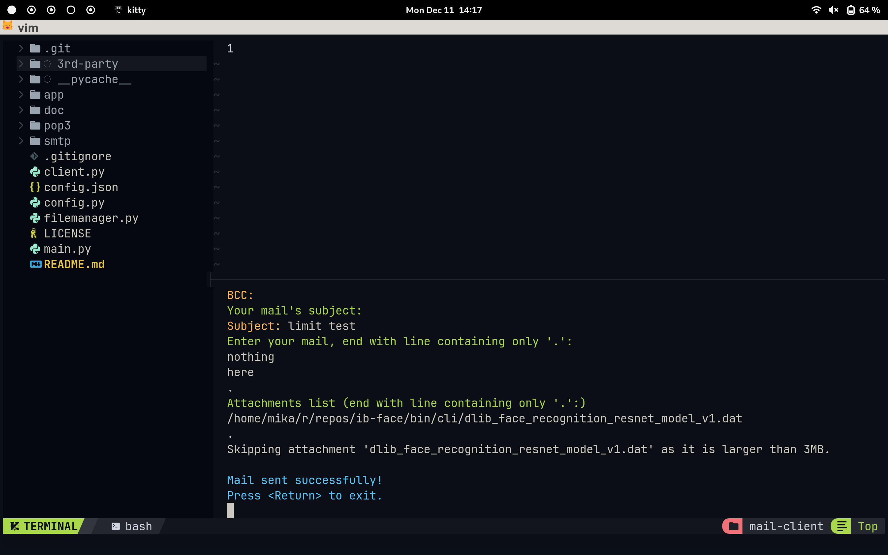

## Mail Receiver Interface

After a mail is downloaded, the client automatically selects an appropriate directory to save the mail to based on its content. Upon asking to read mails in the menu, the users are greeted with this interface:

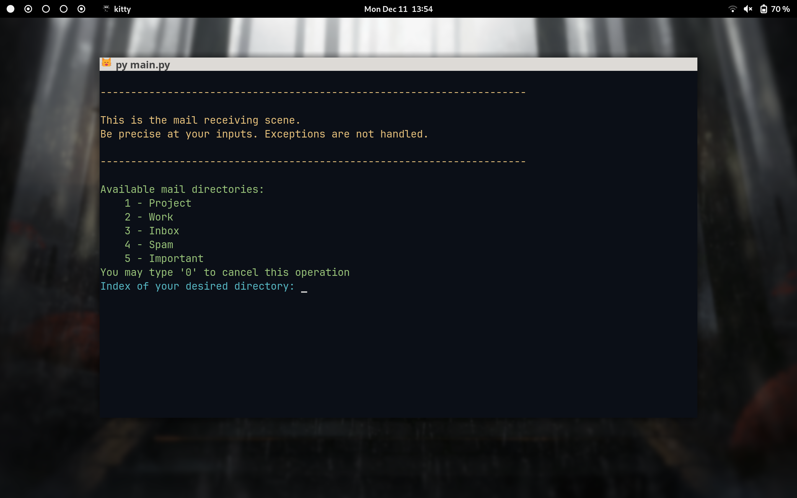

Users can specify which directory to view. Then the program shows:

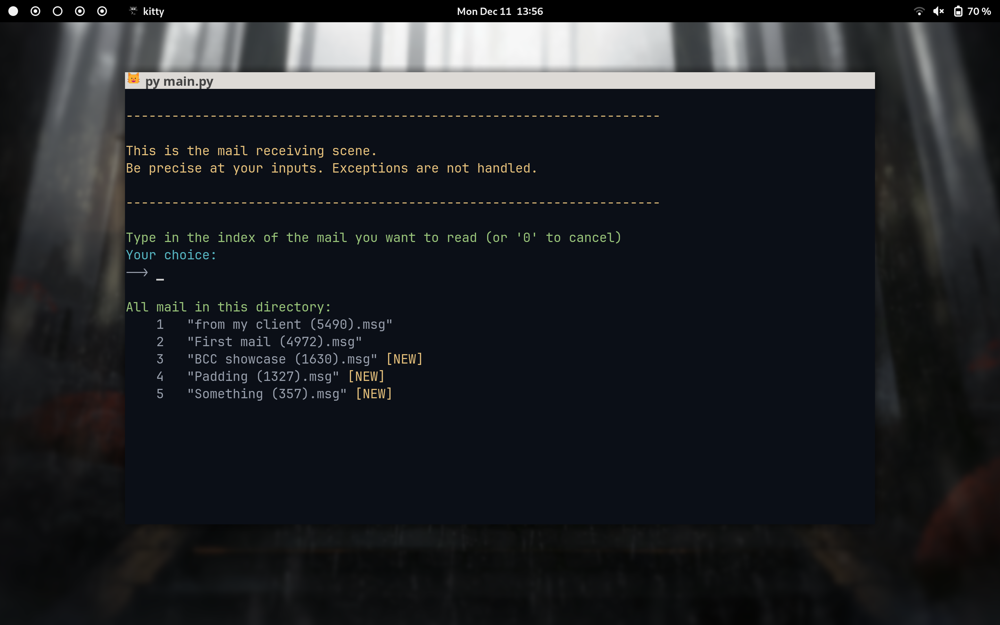

New mails are marked as `[NEW]`. Plus, the interface refreshes at an interval as specified in config.json, so users don't have to worry about missing any mail.

## Mail Viewer

The mail viewer interface is displayed when users open an email:

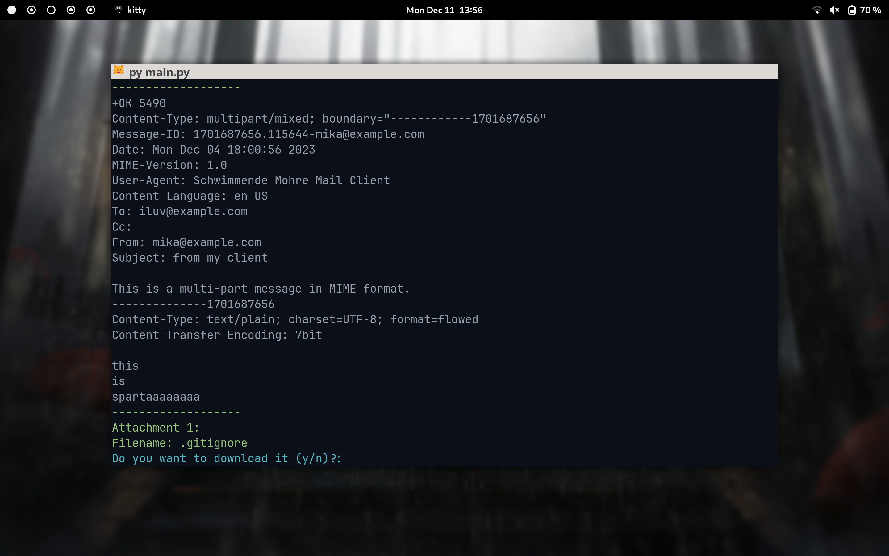

If the email has attachments, users can choose to save them. This operation strictly adheres to the project description which we were given:

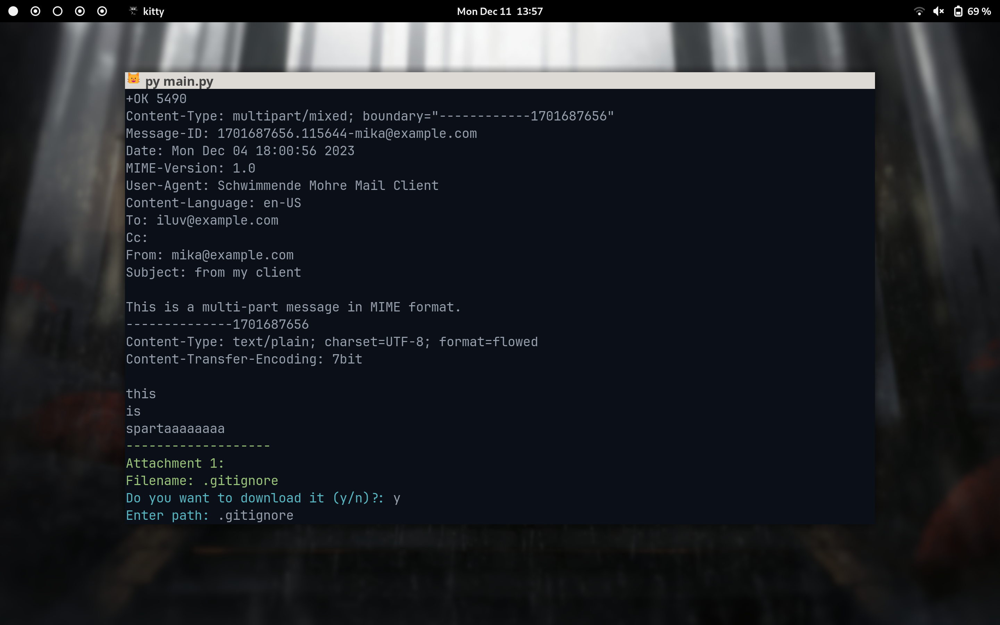

For emails with multiple attachments, users can save them individually:

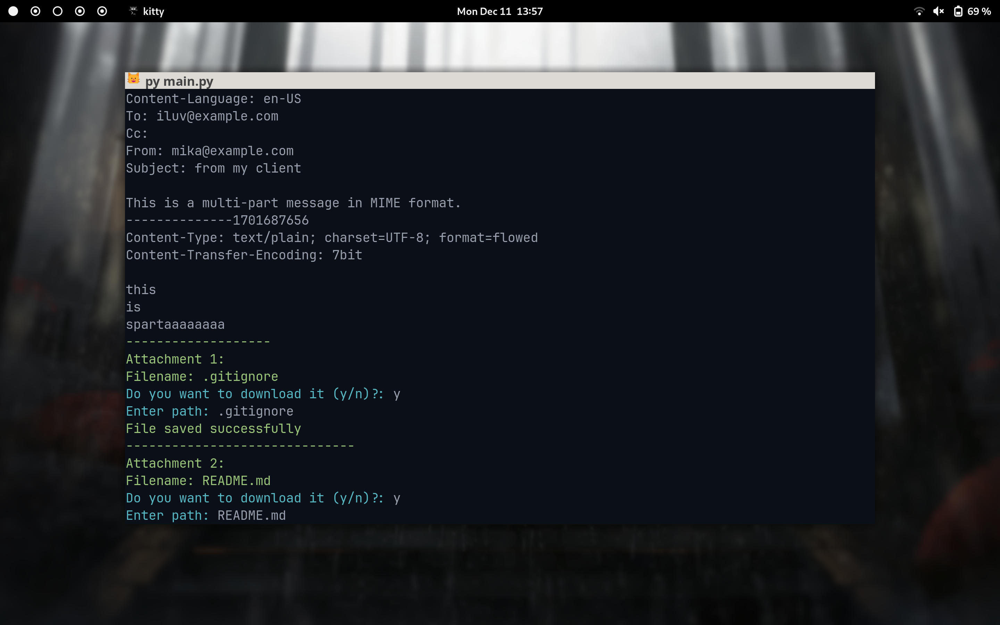

Upon reviewing all content, the client notifies users:

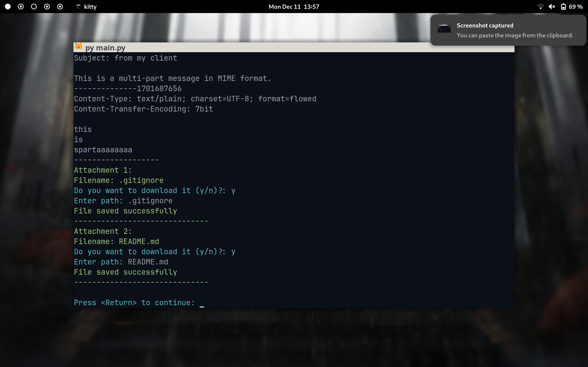

