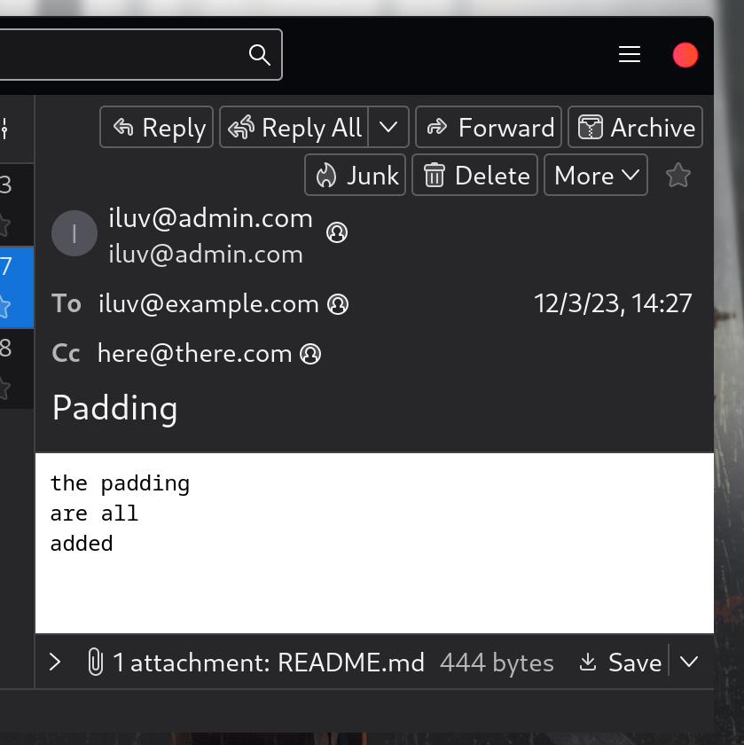

# SMTP

Sending mails — either in TO, CC, or BCC method — all work under a simple protocol called SMTP. This section explains how SMTP was implemented in this project.

## Observation

Using Thunderbird to send a decoy mail to the mail server, we obtained this log:

```py
[09:14:47.350] [worker-0] [INFO ] r.e.t.SMTPHandler:57 - Client connected: /127.0.0.1:51268
[09:14:47.351] [worker-0] [DEBUG] r.e.t.SMTPHandler:64 - >>: 220 Test Mail Server
[09:14:47.368] [worker-0] [DEBUG] r.e.t.SMTPHandler:120 - <<: EHLO [127.0.0.1]
[09:14:47.369] [worker-0] [DEBUG] r.e.t.SMTPHandler:186 - >>: 250 OK
[09:14:47.395] [worker-0] [DEBUG] r.e.t.SMTPHandler:120 - <<: MAIL FROM:<iluv@example.com>
[09:14:47.395] [worker-0] [DEBUG] r.e.t.SMTPHandler:186 - >>: 250 sender <iluv@example.com> OK
[09:14:47.396] [worker-0] [DEBUG] r.e.t.SMTPHandler:120 - <<: RCPT TO:<kumiko@some.where>
[09:14:47.396] [worker-0] [DEBUG] r.e.t.SMTPHandler:186 - >>: 250 recipient <kumiko@some.where> OK
[09:14:47.396] [worker-0] [DEBUG] r.e.t.SMTPHandler:120 - <<: DATA
[09:14:47.397] [worker-0] [DEBUG] r.e.t.SMTPHandler:186 - >>: 354 enter mail, end with line containing only "."
[09:14:47.397] [worker-0] [DEBUG] r.e.t.SMTPHandler:120 - <<: Message-ID: <b73864a6-6e6b-4bd4-8bec-89aab3bc6a27@example.com>
[09:14:47.414] [worker-0] [DEBUG] r.e.t.SMTPHandler:120 - <<: Date: Sat, 11 Nov 2023 09:14:47 +0700
[09:14:47.414] [worker-0] [DEBUG] r.e.t.SMTPHandler:120 - <<: MIME-Version: 1.0
[09:14:47.414] [worker-0] [DEBUG] r.e.t.SMTPHandler:120 - <<: User-Agent: Mozilla Thunderbird
[09:14:47.414] [worker-0] [DEBUG] r.e.t.SMTPHandler:120 - <<: Content-Language: en-US
[09:14:47.414] [worker-0] [DEBUG] r.e.t.SMTPHandler:120 - <<: To: kumiko@some.where
[09:14:47.415] [worker-0] [DEBUG] r.e.t.SMTPHandler:120 - <<: From: iluvgirlswithglasses <iluv@example.com>
[09:14:47.415] [worker-0] [DEBUG] r.e.t.SMTPHandler:120 - <<: Subject: Eupho
[09:14:47.415] [worker-0] [DEBUG] r.e.t.SMTPHandler:120 - <<: Content-Type: text/plain; charset=UTF-8; format=flowed
[09:14:47.415] [worker-0] [DEBUG] r.e.t.SMTPHandler:120 - <<: Content-Transfer-Encoding: 7bit
[09:14:47.415] [worker-0] [DEBUG] r.e.t.SMTPHandler:120 - <<: 
[09:14:47.415] [worker-0] [DEBUG] r.e.t.SMTPHandler:120 - <<: Euphonium!
[09:14:47.415] [worker-0] [DEBUG] r.e.t.SMTPHandler:120 - <<: 
[09:14:47.415] [worker-0] [DEBUG] r.e.t.SMTPHandler:120 - <<: .
[09:14:47.423] [worker-0] [INFO ] r.e.t.SMTPHandler:138 - Message saved to [/home/mika/r/repos/mail-client/3rd-party/.test-mail-server/kumiko@some.where/20231111091447416.msg]
[09:14:47.423] [worker-0] [DEBUG] r.e.t.SMTPHandler:186 - >>: 250 371 bytes accepted
```

By looking at the log, we knew exactly what the mail client must do so as to send a mail like Thunderbird:

```py
[09:14:47.368] [worker-0] [DEBUG] r.e.t.SMTPHandler:120 - <<: EHLO [127.0.0.1]
[09:14:47.395] [worker-0] [DEBUG] r.e.t.SMTPHandler:120 - <<: MAIL FROM:<iluv@example.com>
[09:14:47.396] [worker-0] [DEBUG] r.e.t.SMTPHandler:120 - <<: RCPT TO:<kumiko@some.where>
[09:14:47.396] [worker-0] [DEBUG] r.e.t.SMTPHandler:120 - <<: DATA
[09:14:47.397] [worker-0] [DEBUG] r.e.t.SMTPHandler:120 - <<: Message-ID: <b73864a6-6e6b-4bd4-8bec-89aab3bc6a27@example.com>
[09:14:47.414] [worker-0] [DEBUG] r.e.t.SMTPHandler:120 - <<: Date: Sat, 11 Nov 2023 09:14:47 +0700
[09:14:47.414] [worker-0] [DEBUG] r.e.t.SMTPHandler:120 - <<: MIME-Version: 1.0
[09:14:47.414] [worker-0] [DEBUG] r.e.t.SMTPHandler:120 - <<: User-Agent: Mozilla Thunderbird
[09:14:47.414] [worker-0] [DEBUG] r.e.t.SMTPHandler:120 - <<: Content-Language: en-US
[09:14:47.414] [worker-0] [DEBUG] r.e.t.SMTPHandler:120 - <<: To: kumiko@some.where
[09:14:47.415] [worker-0] [DEBUG] r.e.t.SMTPHandler:120 - <<: From: iluvgirlswithglasses <iluv@example.com>
[09:14:47.415] [worker-0] [DEBUG] r.e.t.SMTPHandler:120 - <<: Subject: Eupho
[09:14:47.415] [worker-0] [DEBUG] r.e.t.SMTPHandler:120 - <<: Content-Type: text/plain; charset=UTF-8; format=flowed
[09:14:47.415] [worker-0] [DEBUG] r.e.t.SMTPHandler:120 - <<: Content-Transfer-Encoding: 7bit
[09:14:47.415] [worker-0] [DEBUG] r.e.t.SMTPHandler:120 - <<: 
[09:14:47.415] [worker-0] [DEBUG] r.e.t.SMTPHandler:120 - <<: Euphonium!
[09:14:47.415] [worker-0] [DEBUG] r.e.t.SMTPHandler:120 - <<: 
[09:14:47.415] [worker-0] [DEBUG] r.e.t.SMTPHandler:120 - <<: .
```

## Implementation

That log is precisely, line-to-line, what our SMTP module does. When you envoke `SmtpClient.send_mail(*args)`, it sends a mail by writing these lines to the server's stdin:

1. `EHLO [127.0.0.1]`: Verifies the host address
2. `MAIL FROM: someone@somewhere`: Indicates who the sender is
3. For every address in receivers list, it writes:
    - `RCPT TO: receiver@somewhere.else`: Indicates the recipient
4. `DATA`: Indicates that the mail's content begins at the next line
5. Writes every line of the mail's content

There is one notice, though, that the mail content is more than just words being sent. Sometimes, you send files; And sometimes, you send your mail to different people in different manners. The next part of this section explains how our SMTP module handles these demands.

## Multipart/Mixed Message

To support attachment sendings, the message is divided into parts, and parts are separated from each other by a designated boundary. A multipart message should look like this format:

```py
Content-Type: multipart/mixed; boundary="------------???????"
<<<headers>>>

This is a multi-part message in MIME format.
--------------???????
Content-Type: text/plain; charset=UTF-8; format=flowed
Content-Transfer-Encoding: 7bit

<<<words from the writer to the readers>>>

--------------???????
Content-Type: application/octet-stream; name="README.md"
Content-Disposition: attachment; filename="README.md"
Content-Transfer-Encoding: base64

<<<a base64 string that depicts the file>>>

--------------???????--
```

The `<<<headers>>>` section does not only tell what time was the mail sent, or what user agent was used by the sender; It also tells who are to receive the mail, and in what way, be it TO, CC, or BCC. For example, our SMTP module composed this mail to the mail server:

```py
Content-Type: multipart/mixed; boundary="------------1701588462"
Message-ID: 1701588462.507059-iluv@admin.com
Date: Sun Dec 03 14:27:42 2023
MIME-Version: 1.0
User-Agent: Schwimmende Mohre Mail Client
Content-Language: en-US
To: iluv@example.com
Cc: here@there.com
Bcc: hidden@bcc.com
From: iluv@admin.com
Subject: Padding

This is a multi-part message in MIME format.
--------------1701588462
Content-Type: text/plain; charset=UTF-8; format=flowed
Content-Transfer-Encoding: 7bit

the padding
are all
added

--------------1701588462
Content-Type: application/octet-stream; name="README.md"
Content-Disposition: attachment; filename="README.md"
Content-Transfer-Encoding: base64

CiMgbWFpbC1jbGllbnQKCkFuIFNNVFAgJiBQT1AzIGdyb3VwIHByb2plY3QgaW4gSENNVVMu
IEluIHRoaXMgcHJvamVjdCwgd2UgY3JlYXRlIGFuIFNNVFAgbGlicmFyeSwgdGhlbiBidWls
ZCBhIG1haWwgY2xpZW50IG9uIGl0LgoKVGhlIG1haWwgc2VydmVyIGluIHVzYWdlOiBbaHR0
cHM6Ly9naXRodWIuY29tL2V1Z2VuZWhyL3Rlc3QtbWFpbC1zZXJ2ZXJdKGh0dHBzOi8vZ2l0
aHViLmNvbS9ldWdlbmVoci90ZXN0LW1haWwtc2VydmVyKQoKQW5kICoqeWVzKiogSSBrbm93
IHdoYXQgcGxhY2VkIGluIGAuL2NsaWAgZGlyZWN0b3J5IGFyZSAqbm90KiBjYWxsZWQgQ0xJ
LiBJIHNob3VsZCBoYXZlIGdpdmVuIHRoaXMgcHJvZ3JhbSBhIGRlY2VudCBjb21tYW5kIGxp
bmUgaW50ZXJmYWNlIGJ1dCBteSBzdHVwaWQgdW5pdmVyc2l0eSBwcmVmZXJzIHRoaXMgd2F5
LiBGdWNrIGl0LgoK

--------------1701588462--
```

Then, using Thunderbird to receive the mail from the server, three people (iluv@example.com, here@there.com, hidden@bcc.com) got this mail:



This example illustrates the capability of our SMTP module to send a mail in both TO, CC, and BCC method. Regarding the BCC method, it is observable that while all three people received the mail, 'hidden@bcc.com' does not present in the recipient list. This is because 'iluv@admin.com' sent this mail to `hidden@bcc.com` via BCC.

Additionally, the example shows that our mail client is capable of sending attachments too.

